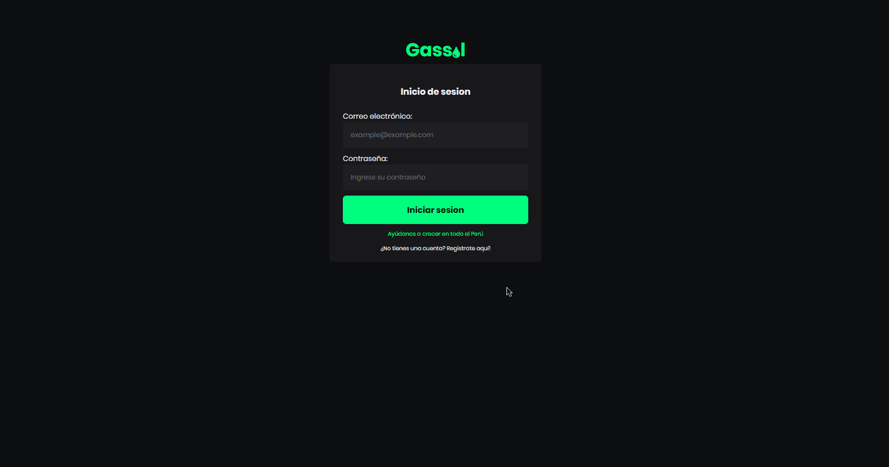
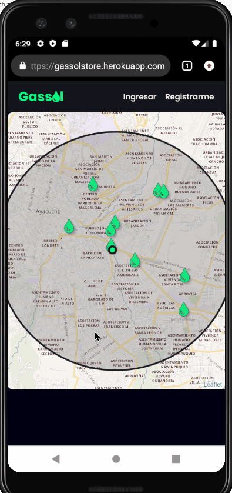

<h1 align="center">
 
  
 
 
Gassol
</h1>

It is responsible for finding gas stations at a range of 2 km from your current position, helped by the community to register your preferred gas station and thus compare prices

[//]: # "Add your gifs/images here:"

  
  

## Features

[//]: # "Add the features of your project here:"

This app features all the latest tools and practices in mobile development!

- ⚛️ **React Js** — A JavaScript library for building user interfaces
- 💹 **Node Js with AdonisJS** — A web framework for Node Js
